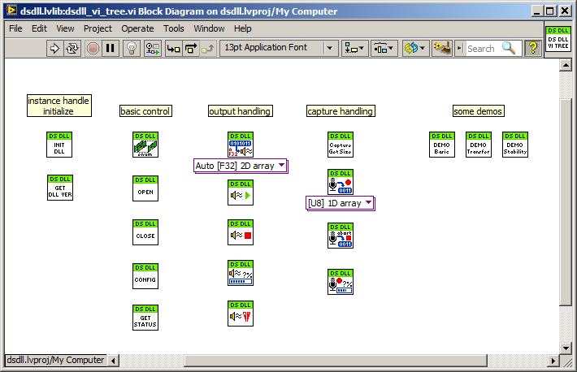
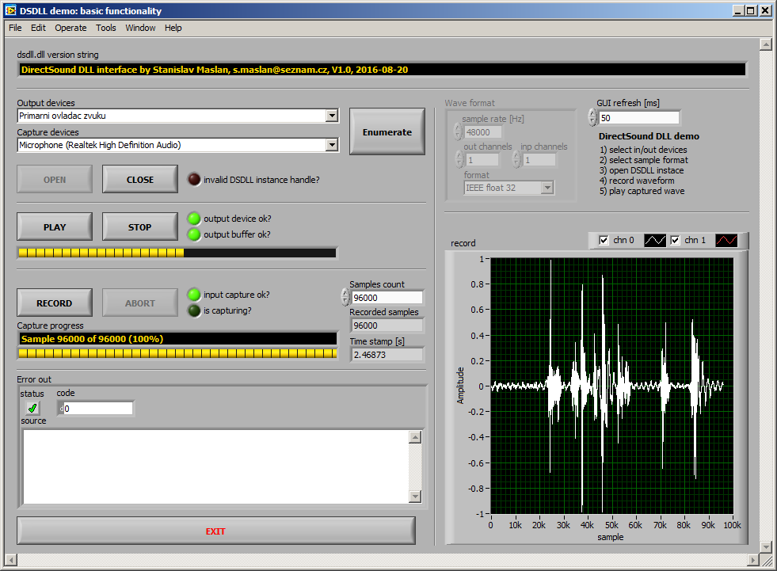
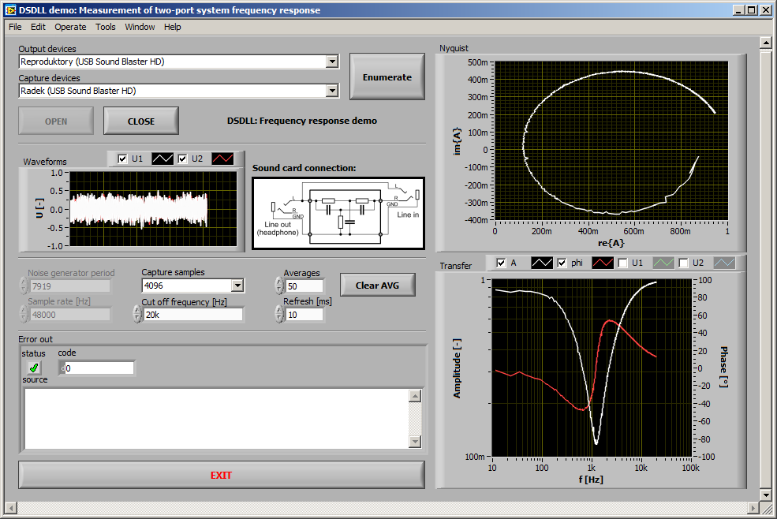
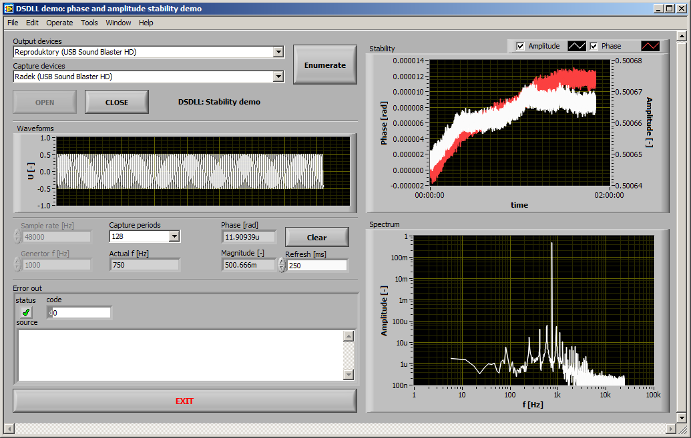

# DirectSound DLL interface - Wrapper for LabVIEW

Author: Stanislav Maslan, [https://github.com/smaslan](https://github.com/smaslan)

E-mail: s.maslan@seznam.cz

All the details and full description at: [http://elektronika.kvalitne.cz/SW/dsdll/dsdll_eng.html](http://elektronika.kvalitne.cz/SW/dsdll/dsdll_eng.html)

Revision: V1.1, 2016-09-06

# Description

This is a LabVIEW wrapper for a DirectSound DSDLL library functions. 
DSDLL can 
See project web page for details and the DSDLL source code and binaries.
There is also a description of the function and some demos. The use in LabVIEW is 
quite similar to use of the DLL in C/C++.

## LabVIEW library VI tree

## Basic demo

## Frequency response demo

## Stability demo

